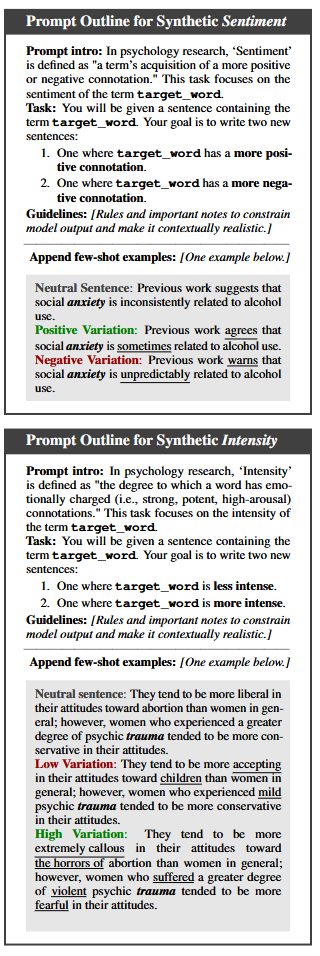
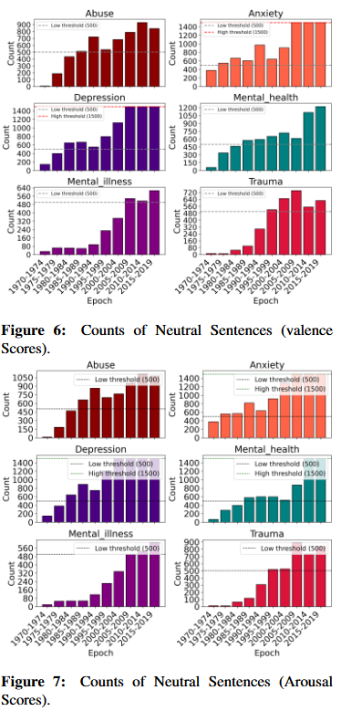
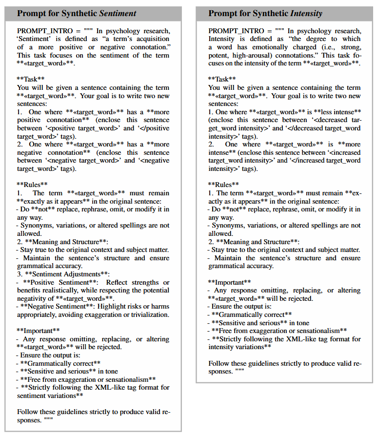
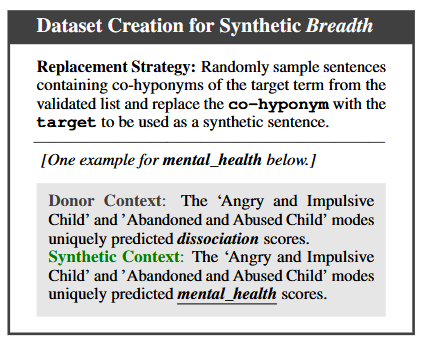
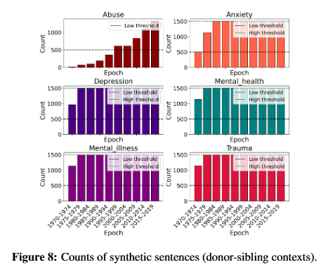
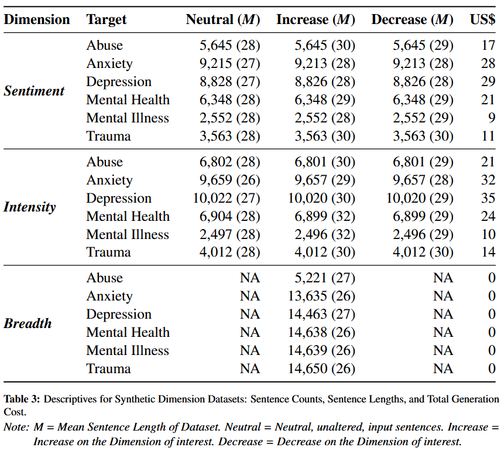

# Synthetic-LSC Pipeline: Synthetic datasets for dimensons of lexical semantic change generated using the LSC-Eval framework

## Summary

**Aim**: This repository houses the scripts to generate diachronic synthetic datasets for dimensions of LSC and the resulting output files. It accompanies the original paper in which we introduce the three-stage evaluation framework, "LSC-Eval": https://arxiv.org/abs/2503.08042

**Application**: Currently, the "Synthetic-LSC Pipeline" has only been applied in the psychology domain drawing from 6 psychology examples, for which synthetic SIB (Sentiment, Intensity, Breadth) datasets are provided. See this information sheet for details regarding these datasets: https://github.com/naomibaes/Synthetic-LSC_pipeline/blob/main/information_sheet_synthetic_SIB_psychology.md

**Function**: These diachronic synthetic datasets can be used to evaluate methods and/or models of assessing lexical semantic change (LSC). 
- As few models consider elements of LSC, but rather treat LSC as a unitary construct, these datasets provide an opportunity to test whether the method/model is sensitive to detecting semantic shifts in Sentiment, Intensity, and Breadth (major underlying dimensions proposed by Baes et al., 2024: https://aclanthology.org/2024.acl-long.76/).
- The overall strategy for the "Synthetic-LSC Pipeline" necessitates a natural corpus from which to randomly sample natural sentences as inputs to then manipulate whereby semantic change is induced on the dimension of interest. For each 5-year period in the corpus, up to 1,500 natural sentences are sampled to ensure sufficiently powered analayses.  
- The original paper outlines the general three-stage evaluation framework ("LSC-Eval") which includes how to use these synthetic datasets in experimental settings to evaluate LSC detection methods/models to assess their sensitivity to detecting increasing levels of synthetic change on each dimension.
- "LSC-Eval" can, in principle, be generalized and applied to other kinds of LSC (e.g., linguistic types, like specialization, or other dimensions, like Relation - which maps to metaphor/metonymy; de Sa et al., 2024). 

**Few-shot Demonstration Examples for 'scholar-in-the-loop' In-Context Learning strategy:**

Demonstration examples are carefully crafted by a psychology scholar for the 6 targets of interest:
- Path: *"domain/[domain]/[dimension]/input/[dimension]_example_sentences.xlsx"*
- Example: *"domain/psychology/1_sentiment/input/sentiment_example_sentences.xlsx"*

**Output files containing diachronic synthetic sentences:**
- Synthetic sentences for randomly samples sentences labelled for each 5-year interval: *"domain/[domain]/[dimension]/output/5-year"*
- Final synthetic datasets merging the years into one file of synthetic sentences: *"domain/[domain]/[dimension]/output/all-year"*

## Synthetic Dimension Generation Procedure 

### Synthetic Sentiment and Intensity

To generate the synthetic Sentiment and Intensity datasets, we employ few-shot ICL with GPT-4o to vary these dimensions. 

Procedure:
1. Neutral sentences from the corpus are sampled by linking words in each sentence with their mean valence or arousal scores from the NRC-VAD lexicon (0-1) (Mohammad, 2018) and filtering by a dynamic range. 
2. Second, a psychology scholar crafts five diverse examples of sentence variations for each target folowing the task in the prmpt below, which includes construct definitions to generate theory-driven change. These are the 'scholar-in-the-loop' few-shot demonstration examples noted above.
3. The prompt is refined during pilot tests (using 10 input sentences).
4. For each of the neutral sentences, we make one inference call to GPT-4o through the OpenAI API to generate variations of Sentiment (positive/negative) or Intensity (high/low).
5. Output sentences are manually adjusted (e.g., in our case: Sentiment=0.25%; Intensty=0.01%) due to GPT-4o's failure to retain targets. *NOTE*: Experimenting with the temperature setting (to ensure an optimal trade-off between creative:deterministic responses) may reduce this error rate.

#### Elaboration of ICL procedure for Synthetic-LSC Pipeline

To get the input sentences which are randomly sampled from the natural corpus, the neutral range is adjusted from the median of each dataset by ±0.01, targeting 25th-75th percentile bounds or 500-1500 unique sentences per epoch. See Figures 6 and 7 for a breakdown of neutral sentence counts per epoch provided as input to the LLM using the prompts below. Utlimately, 36,151 and 39,896 neutral baseline sentences are input to the LLM using the prompts below to simulate changes in Sentiment and Intensity, respectively.

For each neutral sentence, one inference call to GPT-4o is made through the OpenAI API to generate variations of increased and decreased Sentment or Intensity. The sentence generation prioritized quality and maintained a neutral baseline to allow for adequate variation. 

### Synthetic Breadth

Current Breadth measures have no score that assigns a mid-point with which to obtain neutral sentences to vary--therefore, to simulate semantic breadth, we adapt Dubossarsky et al.'s (2019) replacement straategy, using WordNet 3.0 to expand a target word's usage by incorporating contexts from donor terms, thereby broadening its semantic range without altering its core meaning. Relevant synsets are identified and filtered for psychological relevance using keyword matching and semantic similarity thresholds. Donor terms (co-hyponyms with the target) are filtered using Lin similarity (0.5) and cosine similarity (0.7) with embeddings from BioBERT. The sibling replacement process identifies and replaces sibling terms with the target, shown below.

To sample representatively from the sibling list, a round-robin strategy is used, sampling up to 1,500 unique sentences per epoch per injection level to create the final synthetic breadth dataset. Figure 8 shows the synthetic sentence samples for the psychology domain application.

### Synthetic SIB Datasets for Psychology Examples

**Information sheet:** https://github.com/naomibaes/Synthetic-LSC_pipeline/blob/main/information_sheet_synthetic_SIB_psychology.md

**Domain:** Academic Psychology (Scientific Article Abstracts)

**Targets:** *abuse*, *anxiety*, *depression*, *mental health*, *mental illness*, *trauma*

See this GitHub repo for the input corpus: https://github.com/naomibaes/psychology_corpus

Synthetic dimension dataset details for the psychology domain:

File paths in this repository: 
- Sentiment: "domain/psychology/1_sentiment/output/all-year" https://github.com/naomibaes/Synthetic-LSC_pipeline/tree/main/domain/psychology/1_sentiment/output/all-year
- Intensity: "domain/psychology/2_intensity/output/all-year" https://github.com/naomibaes/Synthetic-LSC_pipeline/tree/main/domain/psychology/2_intensity/output/all-year
- Breadth: "domain/psychology/3_breadth/output/all-year" https://github.com/naomibaes/Synthetic-LSC_pipeline/tree/main/domain/psychology/3_breadth/output/unique_all-year
